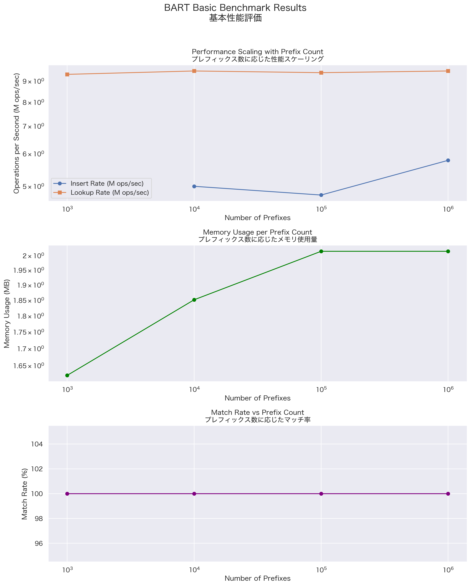
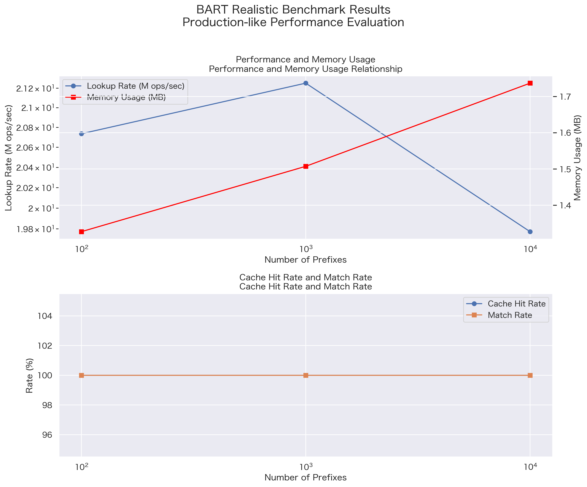
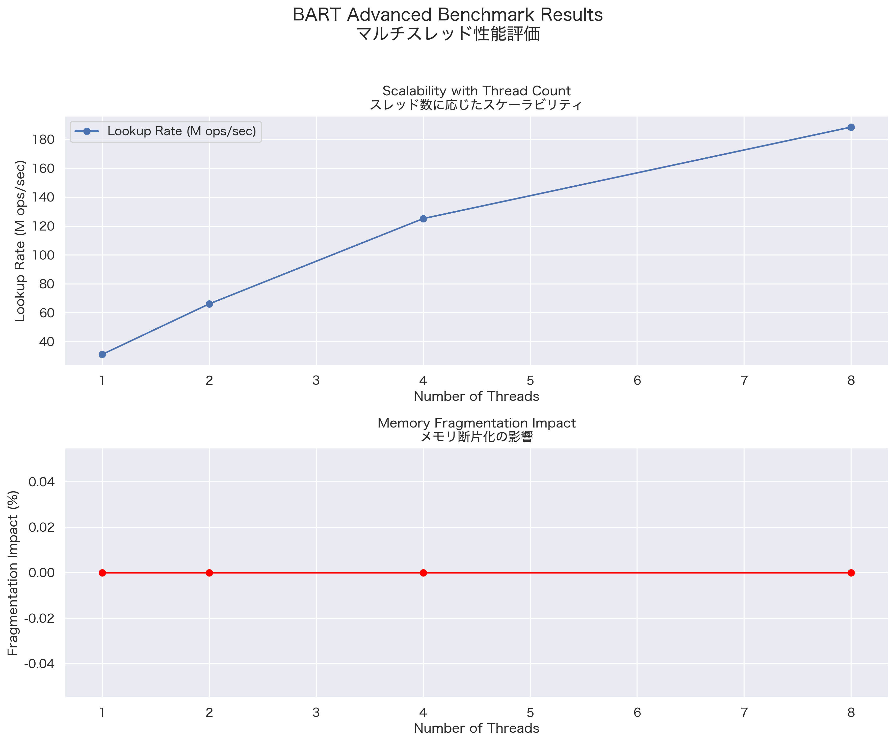

## zart
bitmap based art table.

## Benchmark

### Basic bench


Basic performance evaluation measures performance from three perspectives:
- Insert and search performance based on prefix count
- Memory usage trends
- Match rate verification

### Realistic bench


Production environment evaluation focuses on:
- Relationship between performance and memory usage
- Cache hit rate and match rate trends

### Multithreading bench


Multithreaded performance evaluation measures:
- Scalability based on thread count
- Impact of memory fragmentation

## Running Benchmarks

To run all benchmark tests:
```bash
make all-bench
```
CSV files and images will be created in `/assets` directory.

To run individual benchmark tests:
```bash
# Basic performance evaluation
zig build bench -Doptimize=ReleaseFast

# Production-like performance evaluation
zig build rt_bench -Doptimize=ReleaseFast

# Multithreaded performance evaluation
zig build advanced_bench -Doptimize=ReleaseFast
```

## Setup
`nix develop`

## CGO

## Ref
[art](https://github.com/hariguchi/art)
